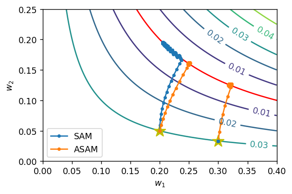

# Adaptive Sharpness-Aware Minimization (ASAM)

This repository contains Adaptive Sharpness-Aware Minimization (ASAM) for training rectifier neural networks.
This is an official repository for [ASAM: Adaptive Sharpness-Aware Minimization for Scale-Invariant Learning of Deep Neural Networks](https://arxiv.org/abs/2102.11600) which is **accepted to International Conference on Machine Learning (ICML) 2021**.

<p align="center">
    
</p>


## Abstract
Recently, learning algorithms motivated from sharpness of loss surface as an effective measure of generalization gap have shown state-of-the-art performances. Nevertheless, sharpness defined in a rigid region with a fixed radius, has a drawback in sensitivity to parameter re-scaling which leaves the loss unaffected, leading to weakening of the connection between sharpness and generalization gap. In this paper, we introduce the concept of adaptive sharpness which is scale-invariant and propose the corresponding generalization bound. We suggest a novel learning method, adaptive sharpness-aware minimization (ASAM), utilizing the proposed generalization bound. Experimental results in various benchmark datasets show that ASAM contributes to significant improvement of model generalization performance.

## Getting Started
### Requirements
- PyTorch (>= 1.8)
- torchvision (>= 0.9)
- timm (>= 0.4.9)
- homura-core (>= 2021.3.1)

### Train Examples (CIFAR)
CIFAR-10 dataset:
```
python example_cifar.py --dataset CIFAR10 --minimizer ASAM --rho 0.5
```
CIFAR-100 dataset:
```
python example_cifar.py --dataset CIFAR100 --minimizer ASAM --rho 1.0
```
We can also run SAM optimizer for CIFAR-10 or CIFAR-100 dataset:
```
python example_cifar.py --dataset CIFAR10 --minimizer SAM --rho 0.05
python example_cifar.py --dataset CIFAR100 --minimizer SAM --rho 0.10
```


## License
<a rel="license" href="http://creativecommons.org/licenses/by-nc-nd/3.0/"></a>
